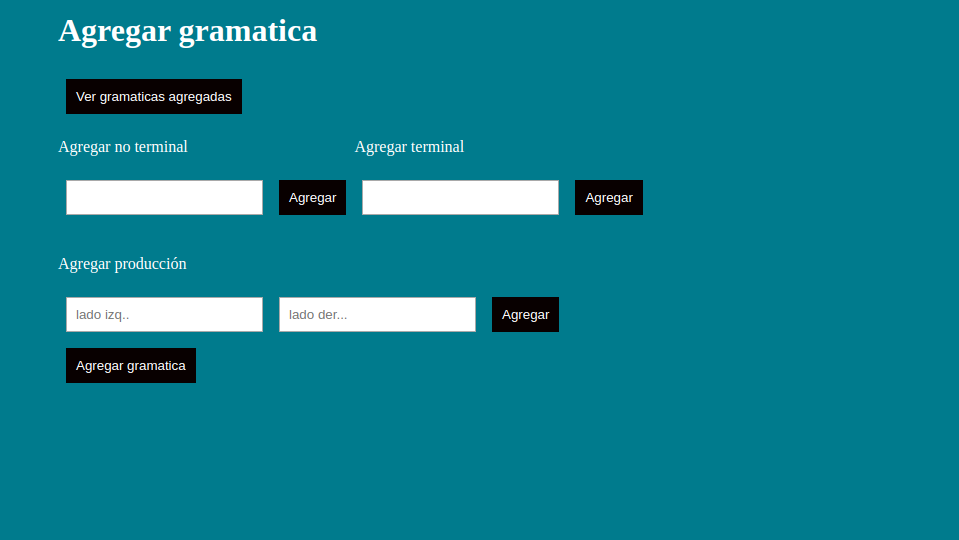
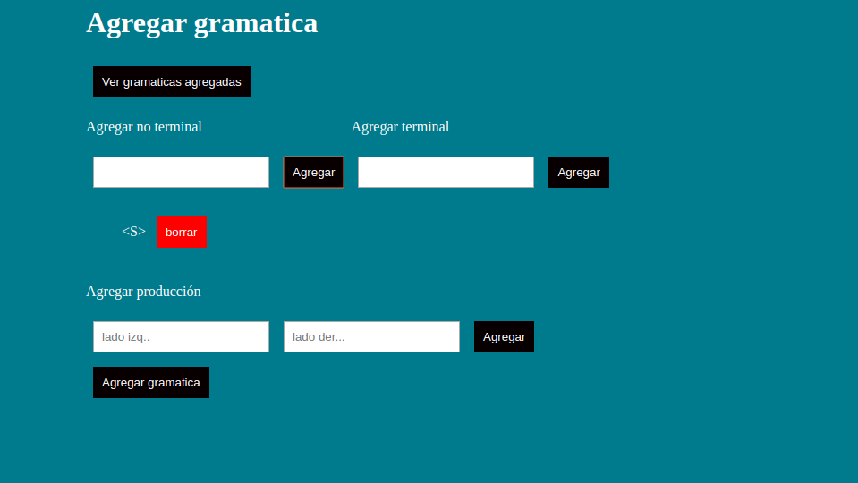
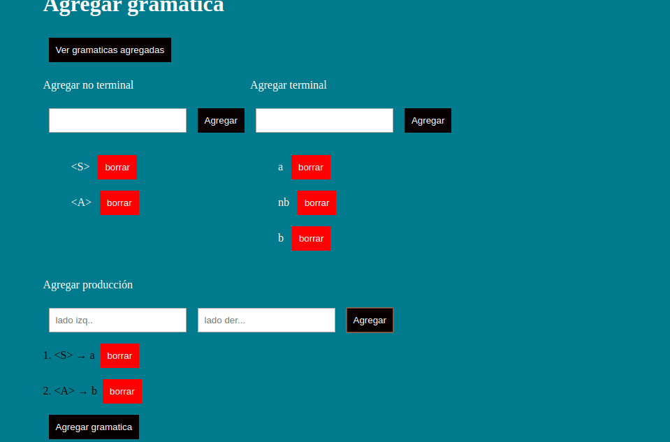

# Manual de Usuario

## Consideraciones iniciales

Para poder probar esta práctica en su máquina, usted debe dirigirse al repositorio: [https://github.com/luis8alopez/PracticaDos](https://github.com/luis8alopez/PracticaDos) luego de esto, usted deberá clonar el proyecto y dirigirse a la carpeta donde quedó clonada desde su consola. Ahora, para ejecutar el proyecto usted debe ingresar el siguiente comando es su terminal.

```text
npm install
```

Luego de ejecutar dicho comando, se instalarán las dependencias necesarias para que el proyecto pueda funcionar en total normalidad.

Ahora para poder ejecutar el proyecto, debemos levantar el servidor, para lo cual utilizaremos el siguiente código.

```javascript
ng serve
```

Luego de esto, nuestro servidor estará levantado, ahora, nos dirigiremos desde nuestro navegador de Google Chrome hacia la dirección: [http://localhost:4200/](http://localhost:4200/ingresarGramatica) Esta dirección nos llevará a la siguiente vista.



Ahora, para hacer uso del aplicativo, necesitamos ingresar no terminales en el formato definido para este proyecto, el cual se explicará a continuación.

Para ingresar un no terminal válido, usted deberá ingresarlo del siguiente modo: &lt;NombreDeSuNoTerminal&gt; donde el nombre puede ser cualquier línea de caracteres. Luego de esto, podemos proceder a agregarlo, pulsando el botón agregar al lado derecho del cajón. El resultado será.



Análogamente, procedemos a realizar el mismo proceso para agregar terminales que serán usados en las producciones de nuestra gramática, para los nombres de los terminales, no tenemos un estandar definido, entonces procedemos a ingresarlos.


Ahora procederemos a ingresar más no terminales y terminales, con el fin de poblar nuestras producciones a ser reconocidas.

Ahora, tenemos que crear las producciones que contienen los terminales y no terminales que creamos anteriormente, para esto, nos dirigimos al cajón de la parte inferior izquierda. Allí, ingresaremos el lado izquierdo de nuestra producción, sabemos que tiene que ser un no terminal, luego de esto, procedemos a agregar el lado derecho de nuestra producción, que puede ser cualquier línea de terminales o no terminales que hayamos agregado previamente. Luego de hacer dicho paso, obtendremos algo como esto:



Luego de este paso, podremos ver en la parte inferior, la gramática que hemos creado, luego de este proceso, podemos proceder a agregar la gramática y poder identificar si dicha gramática es de la forma S, Q o LL\(1\), como podemos observar, la gramática ejemplificada no pertenece a ninguno de los tipos previamente mencionados, por lo tanto, nuestro programa desplegará un mensaje diciendo eso.

Ahora damos al botón agregar.


Como podemos observar, se desplegó la gramática ingresada, el tipo de la gramática y su respectivo conjunto de selección.

Damos por terminado este manual.

